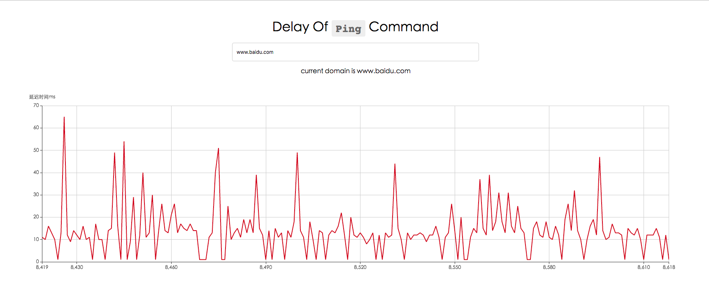

# visualping

- visualping is a Visualization of Ping commands

## 启动ping命令

首先使用以下命令，进行对某个网站的ping操作

```shell
    > ping www.baidu.com >> data.txt
```

## 启动server

因为页面使用了ajax, 所以需要一个server; 我这里使用的是http-server

```shell
    > http-server -p3000 -o
```

## 打开页面，输入你刚才ping的网站域名

页面打开的时候， 默认显示的是正在ping百度的官网www.baidu.com， 可在文本框中数据你刚才ping的那个网站域名按回车。这样页面显示就正确了。
（其实这个功能毫无卵用）。


